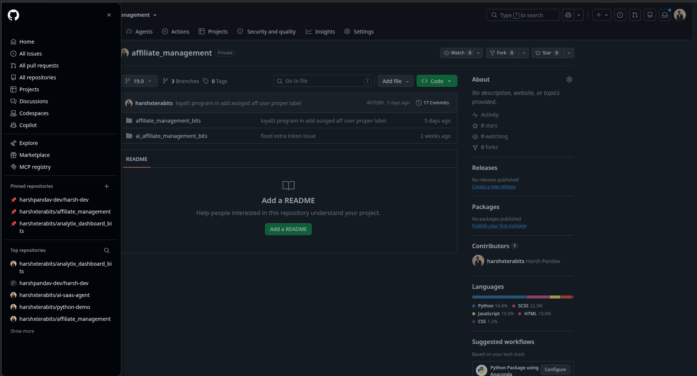

# GitPin

Pin any GitHub repository — including private ones — to the top of the GitHub sidebar.

GitHub's sidebar shows "Top repositories", picked by its own recency heuristic. If you
work across a handful of repos every day, the ones you want keep sinking below the fold.
GitPin adds a **📌 Pinned repositories** section right above it, with exactly the repos
you chose, in the order you chose.



## Install

Not on the Chrome Web Store — load it unpacked:

1. Clone this repo.
2. Open `chrome://extensions` (or `edge://extensions`, `brave://extensions`).
3. Turn on **Developer mode**.
4. **Load unpacked** → select the cloned folder.

### Firefox

This branch (`firefox`) is the Firefox build. Load it via `about:debugging#/runtime/this-firefox`
→ **Load Temporary Add-on** → pick `manifest.json`. A temporary add-on is removed when
Firefox restarts; to keep it, package it and install a signed build from
[AMO](https://addons.mozilla.org/developers/).

Two things differ from the `main` (Chrome) branch:

- `browser_specific_settings.gecko.id` — Firefox refuses `storage.sync` without an
  add-on ID, so pins would silently fail to persist. Chrome ignores this key.
- `popup.js` resolves `browser ?? chrome` — Firefox's `chrome.*` shim is callback-only,
  while `browser.*` returns promises. Chrome MV3 already has promises on `chrome.*`, so
  the same line works on both.

`content.js` is untouched between branches; it only uses callback/fire-and-forget APIs
that behave the same either way.

## Usage

Open the GitHub sidebar (the ☰ panel). **📌 Pinned repositories** sits right above
"Top repositories".

- **Pin by dragging** — drag any repo out of "Top repositories" (or any repo link on the
  page) and drop it on the pinned section.
- **Pin the repo you're on** — click the GitPin toolbar icon → **📌 Pin**.
- **Unpin** — hover a pinned repo and click the ✕, or use the popup.
- **New repository** — the ✛ button top-right of the section heading, straight to
  `github.com/new`.

Drag-to-pin uses the native HTML5 drag API. GitHub's sidebar entries are ordinary `<a>`
tags, so they are already draggable and already carry their URL — GitPin just listens for
the drop. No drag library, and nothing patched onto GitHub's elements.

Pins are stored in `chrome.storage.sync`, so they follow your browser profile across
machines when Chrome sync is on.

## Private repositories

No GitHub token, no OAuth app, no API calls. GitPin only ever stores strings like
`owner/repo` and renders links to `https://github.com/owner/repo`. Your existing browser
session is what grants access when you click through — the extension never reads
repository content and never talks to any server.

## Permissions

| Permission | Why |
|---|---|
| `storage` | Save your pinned list |
| `https://github.com/*` | Inject the sidebar section; read the current tab's URL so the popup knows which repo you're on |

That's the whole list. No `tabs`, no analytics, no network access.

## How it works

`content.js` finds GitHub's "Top repositories" group in the sidebar panel and inserts a
cloned copy of it, rewritten with your repos.

The interesting bit: GitHub's class names are build-hashed
(`prc-ActionList-Group-lMIPQ`), so they change on every deploy. Rather than hardcoding
them, GitPin **clones GitHub's own heading and list-item nodes** and swaps the text and
`href`. The pinned section inherits GitHub's styling for free and keeps looking native
across redeploys, in light and dark themes.

The one thing that can break is the anchor — GitPin locates the group via
`[data-testid="dynamic-side-panel-items-search-button"]`. If GitHub drops that testid,
the section stops appearing (it fails silently, nothing else breaks) and that one
selector in `content.js` needs updating.

```
manifest.json   MV3 manifest
content.js      finds the sidebar group, clones it, injects the pinned section,
                handles drag-and-drop pinning and the ✕ unpin button
style.css       hover/drop-target styling for the injected section
popup.html/js   pin/unpin the current repo, list and remove pins
repo.js         parse "owner/repo" out of a github.com pathname
test.cjs        self-check for the parser — `node test.cjs`
```

## Contributing

Plain JavaScript, no build step, no dependencies. Edit a file, hit reload on
`chrome://extensions`, done. If you touch `repo.js`, run `node test.cjs`.

Deliberately out of scope: reordering pins by dragging, folders/groups, repo search,
syncing with GitHub stars. Issues and PRs welcome if you disagree — but the appeal of
this thing is that it's a handful of small files with no dependencies.

## License

MIT — see [LICENSE](LICENSE).
